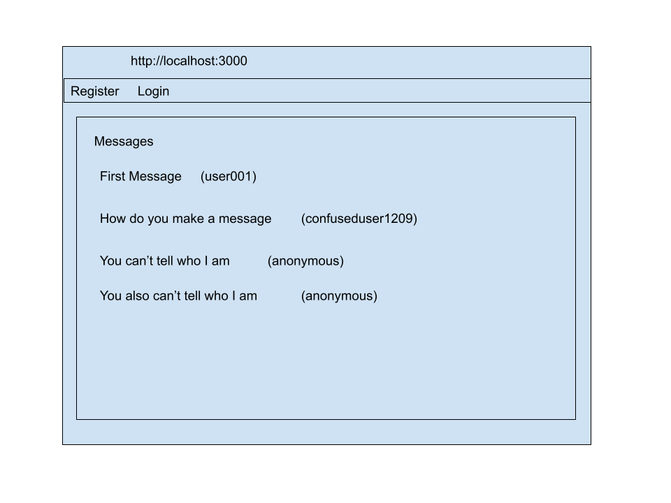
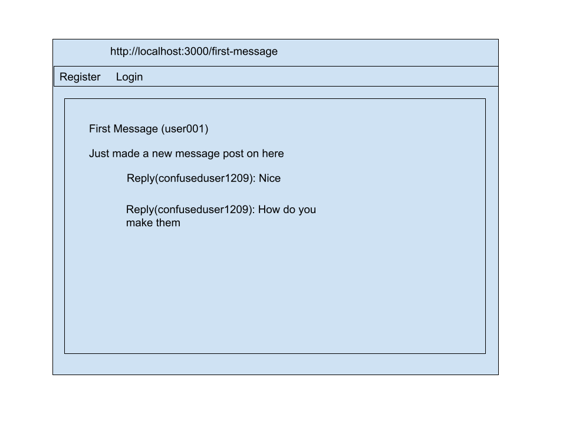

* See [example milestone #01](https://github.com/nyu-csci-ua-0480-008-spring-2017/final-project-example)
* Add images to your repository and link / display with markdown

The content below is an example project proposal / requirements document. Replace the text below the lines marked "__TODO__" with details specific to your project. Remove the "TODO" lines.


# Message Board(name needs work)

## Overview


Message Board is a simple web based message board that allows users to create an account and then post messages, either from their username or anonymously.  Users can then view messages as well as reply to them.  Users can also possibly private message other users.


## Data Model


The application will store Users (with login info), Messages, and Replies, with possible support for direct user to user messages if I can figure it out.


An Example User:

```javascript
{
  username: "messageposter",
  hash: // a password hash,
  messages: // an array of message objects containing the replies to the messages as well
}
```

An Example Message with example replies:

```javascript
{
  user: // a reference to a User object
  title: "Hello World",
  message:{initial:'This is the first message on this site',
  reply1:/*reference to a reply which is stored in another User*/,
  reply2:/*reference to a reply which is stored in another User*/},
  createdAt: // timestamp
}
```


## [Link to Commented First Draft Schema](src/db.js)


## Wireframes


/ - homepage showing some messages and register/login



/first-message - sample message




## Site map


## User Stories or Use Cases


1. as non-registered user, I can register a new account with the site
2. as a user, I can log in to the site
3. as a user, I can post a message
4. as a user, I can view all of the messages and replies
5. as a user, I can reply to messages

## Research Topics

*passport and vue.js (5 points each)


## [Link to Initial Main Project File](src/app.js)


## Annotations / References Used


1. [passport.js authentication docs](http://passportjs.org/docs) - (add link to source code that was based on this)
2. [tutorial on vue.js](https://vuejs.org/v2/guide/) - (add link to source code that was based on this)
